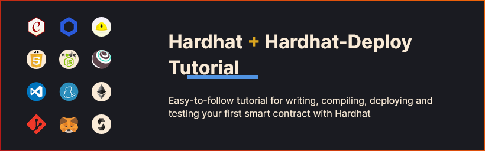

<div align="center">
    
</div>

## Overview

This tutorial aims to help beginner developers how to setup and structure a project using Hardhat - a development environment that facilitates building in Ethereum.

Hardhat helps developers to manage and automate the recurring tasks that are inherent to the process of building smart contracts and decentralized applications (dApps), it also allows you to easily introduce new functionalities due to its unopinionated quality.

Hardhat consist of different components for editing, compiling, debugging and deploying your smart contracts and dApps, all of which work together to create a robust development environment.

Hardhat comes built-in with the Hardhat Network, a local Ethereum blockchain design for development. This local network allows you to deploy contracts, run tests and debug your code as if you were testing in a live network.

In this tutorial I'll guide you through:

-   Setting up your Node.js environment for Ethereum development using Windows
-   Creating and configuring a Hardhat project
-   The basics of a Solidity smart contract that implements a token
-   Writing automated tests for your contract using Hardhat
-   Debugging Solidity with `console.log()` using Hardhat Network
-   Deploying your contract to Harhdat Network and to a Ethereum testnet

To fully comprehend this tutorial you should know how to:

-   Understand the basics of [JavaScript](https://developer.mozilla.org/en-US/docs/Learn/Getting_started_with_the_web/JavaScript_basics)
-   Operate a terminal using VS Code
-   Use git
-   Understand the basics of how [smart contracts](https://chain.link/education/smart-contracts) work
-   Set up a [Metamask](https://metamask.io/) wallet

If you don't know any of the aforementioned points, please take your time to do your research.

## A. Setting Up The Environment

### Installing Node.js

### Windows

Fow windows it's strongly recommended to use Windows Subsystem for Linux (also known as WSL 2). You can use Hardhat without it, but it'll work better if you use it.

To install Node.js using WSL 2 make sure, please follow this [guide](https://learn.microsoft.com/en-us/windows/dev-environment/javascript/nodejs-on-wsl).

Also make sure you have [have `git` installed on WSL](https://learn.microsoft.com/en-us/windows/wsl/tutorials/wsl-git).

### Upgrading your Node.js installation

If your version of Node.js is olde than `16.0` or ins't compatible with `hardhat` you will need to upgrade Node.js.

### Windows

You need to follow the same installation instruccions as before but choose a different version. You can check the list of avaliable versions [here](https://nodejs.org/en/download/releases/) or simply install the recommended version.

### Installing Yarn

For this tutorial we will use [Yarn](https://yarnpkg.com/) as our package manager. To install it run in the terminal:

```
npm install -g yarn
```

## B. Setting Up A Hardhat Project

To create a new Hardhat project run in your terminal the following commands:

```
mkdir hardhat-deploy-tutorial
cd hardhat-deploy-tutorial
yarn init --yes
yarn add -D hardhat
```

Note: Installing Hardhat will also install some Ethereum JavaScript dependencies, this process might take some time so be patient.

After the installation has completed, in your root directory add a `hardhat.config.js`. For this tutorial we are going to use Solidity 0.8.8 compiler.

```javascript
require("hardhat-deploy")

module.exports = {
    solidity: {
        version: "0.8.8",
    },
}
```

### Hardhat's architecture

Hardhat is designed around the concepts of tasks and plugins. The bulk of Hardhat's functionality comes from [plugins](https://hardhat.org/hardhat-runner/plugins) and free to use the one you want to set a robust development environment.

### Tasks

Every time you're running Hardhat from the command-line, you're running a task. e.g. `yarn hardhat deploy` is running the deploy task. To explore the current avaliable task provided by Hardhat run in the command line `yarn hardhat help`.

You can also create your own tasks, to do so follow [this guide](https://hardhat.org/hardhat-runner/docs/advanced/create-task).

### Plugins

Hardhat is unopinionated in terms of what tools you end up using, but it does come with some built-in defaults. All of which can be overriden. Most of the time to use a tool is by consuming a plugin that has been integrated into Hardhat.

For this tutorial we're going to use the `hardhat-deploy` and `hardhat-deploy-ethers` plugins -- these plugins will allow us to interact with Ethereum and to test our contracts. Also to create a robust development enviroment we will install `ethers`, `chai`, `ethereum-waffle` and other plugins. Feel free to investigate each after installing them.

To install the dependencies paste in your terminal the following command:

```
yarn add -D @nomiclabs/hardhat-ethers@npm:hardhat-deploy-ethers@^0.3.0-beta.13 ethers hardhat-deploy dotenv solidity-coverage prettier ethereum-waffle chai @nomiclabs/hardhat-waffle
```

Let's import `@nomiclabs/hardhat-ethers` to `hardhat.config.js`, this plugin will bring `ethers.js` library into hardhat.

```javascript
require("hardhat-deploy")
require("@nomiclabs/hardhat-ethers")

module.exports = {
    solidity: {
        version: "0.8.8",
    },
}
```

## C. Writing and Compiling Smart Contracts

We're going to create a simple smart contract that implements a token that can be transferred to different accounts. Token contracts are most frequently used to send tokens or to exchange or store value. A token contract is not more that a mapping of addresses to balances.

This tutorial will not cover in depth how to use Solidity to code a smart contract, but there's some basic logic to be implemented that you should know:

-   There is a fixed supply of tokens, this is immutable.
-   The entire supply is assigned to the address that deploys the contract.
-   Anyone can receive tokens.
-   Anyone with at least one token can transfer tokens.
-   The token is not divisible. You can only transfer integers.
-   Anyone with at least one token can burn tokens.

Note: for simplicity this token will not comply with the ERC-20 standard in Ethereum.

### Writing smart contracts

Hardhat uses by default a `contracts` directory as the source folder to, but in this tutorial we will use instead `src`. Therefore you need to edit your `hardhat.config.js` file with the new config:

```javascript
require("hardhat-deploy")
require("@nomiclabs/hardhat-ethers")

module.exports = {
    solidity: {
        version: "0.8.8",
    },
    paths: {
        sources: "src",
    },
}
```

Create a new directory called `src` and create a file inside called `Token.sol`.

Paste the code below into the file and take the time you need to read and understand the contract. The contract is quite simple and it's full of comments explaining some of the basics of Solidity.

Note: To get syntax highlighting you should add Solidity support to your text editor. I recommend installing [Solidity](https://marketplace.visualstudio.com/items?itemName=NomicFoundation.hardhat-solidity).

```javascript
// SPDX-License-Identifier: MIT
// The line above is recommended and let you define the license of your contract

// Solidity files have to start with this pragma.
// It will be used by the Solidity compiler to validate its version.
pragma solidity ^0.8.8;

// This is the main building block for smart contracts.
contract Token {
    // Some string type variables to identify the token.
    // The `public` modifier makes a variable readable from outside the contract.
    string public name = "My Hardhat Token";
    string public symbol = "MHT";

    // The fixed amount of tokens stored in an unsigned integer type variable.
    uint256 public totalSupply = 1000000;

    // An address type variable is used to store ethereum accounts.
    address public owner;

    // A mapping is a key/value map. Here we store each account balance.
    mapping(address => uint256) balances;

    // Events helps off-chain application understand what happens
    // within your contract
    event Transfer(address indexed _from, address _to, uint256 _value);
    event Burn(address indexed _from, address _to, uint256 _value);

    /**
     * Contract initialization.
     *
     * The `constructor` is executed only once when the contract is created.
     */
    constructor(address _owner) {
        // The totalSupply is assigned to transaction sender, which is the account
        // that is deploying the contract.
        balances[_owner] = totalSupply;
        owner = _owner;
    }

    /**
     * A function to transfer tokens.
     *
     * The `external` modifier makes a function *only* callable from outside
     * the contract.
     */
    function transfer(address to, uint256 amount) external {
        // Check if the transaction sender has enough tokens.
        // If `require`'s first argument evaluates to `false` then the
        // transaction will revert.
        require(balances[msg.sender] >= amount, "Not enough tokens");

        // Transfer the amount.
        balances[msg.sender] -= amount;
        balances[to] += amount;

        emit Transfer(msg.sender, to, amount);
    }

    /**
     * A function to burn tokens.
     *
     * The `external` modifier makes a function *only* callable from outside
     * the contract.
     */
    function burn(uint256 amount) external {
        require(balances[msg.sender] >= amount, "Not enough tokens");

        balances[msg.sender] -= amount;
        totalSupply -= amount;

        emit Burn(msg.sender, address(0), amount);
    }

    /**
     * Read only function to retrieve the token balance of a given account.
     *
     * The `view` modifier indicates that it doesn't modify the contract's
     * state, which allows us to call it without executing a transaction.
     */
    function balanceOf(address account) external view returns (uint256) {
        return balances[account];
    }
}
```

### Compiling smart contracts

To compile the contract run `yarn hardhat compile` in your terminal. This command will execute the `compile` task which is one of the built-in tasks in `hardhat`. The output should look similar to this:

```
$ yarn hardhat compile

Compiled 2 Solidity files successfully
Done in 2.11s.
```

This means the contract has been successfully compiled and its ready to be deploy.

## D. Deploying Smart Contracts

Before deploying and testing your contract, you must set the deployment process that will be used both for testing as well for the deployment of your contract in various live networks. This strategy will allow you to focus on that your contract should look in its final form, setup their parameters and dependencies, and ensure your tests are running against the exact code that will be deployed.

This also eliminate the need to duplicate the deployment procedures. All of this is possible thanks to `hardhat-deploy` plugin.

### Writing deployment scripts

Create a new directory called `deploy` in the project root, inside it create a new filed called `00-deploy-token.js`.

Let's start with code below and it will be explain soon, but for now paste this code into the deploy script.

```javascript
module.exports = async (hre) => {
    const { deployments, getNamedAccounts } = hre
    const { deploy } = deployments
    const { deployer, tokenOwner } = await getNamedAccounts()

    await deploy("Token", {
        from: deployer,
        args: [tokenOwner],
        log: true,
    })
}

module.exports.tags = ["token"]
```

**getNamedAccounts:**

The plugin `hardhat-deploy` allows you to name your accounts, in this script there are two named accounts:

-   `deployer` will be the account that deploy the contract.
-   `tokenOwner` which is passed to the constructor of `Token.sol` and which will receive the initial supply.

These accounts need to be setup in `hardhat.config.js`.

```javascript
require("hardhat-deploy")
require("@nomiclabs/hardhat-ethers")

module.exports = {
    solidity: {
        version: "0.8.8",
    },
    namedAccounts: {
        deployer: {
            default: 0,
        },
        tokenOwner: {
            default: 1,
        },
    },
    paths: {
        sources: "src",
    },
}
```

`deployer` will be the account in the zeroed index and `tokenOwner` will be second account.

`hardhat-deploy` is flexible in how you can named the accounts, instead of indexes you can use hard-coded addresses or even references to other named accounts. You can also have different addresses based on each network. You know more about this in the documentation [here](https://github.com/wighawag/hardhat-deploy#1-namedaccounts-ability-to-name-addresses).

In your terminal run the command `yarn hardhat deploy`, this will execute the `deploy`task. The output should look like this:

```
$ yarn hardhat deploy

Nothing to compile
deploying "Token" (tx: 0xd597d5e90c97906f91712d6cf661b9f2c4383debb427e55128a25ab1cd1e5de6)...: deployed at 0x5FbDB2315678afecb367f032d93F642f64180aa3 with 676005 gas

```

You contract was deployed to the `in-memory` Hardhat network and the output indicates that the deployment was successful.

Now we can write test against this contract, but first let's add comments to the deploy script to explain each line that matters:

```javascript
module.exports = async (hre) => {
    const { deployments, getNamedAccounts } = hre // we get the deployments and the getNamedAccounts which are provided by Hardhat Runtime Environment (hre)
    const { deploy } = deployments // the deployment field itself contains the deploy function from hardhat-deploy
    const { deployer, tokenOwner } = await getNamedAccounts() // fetch the accounts. This can be configure in hardhat.config

    await deploy("Token", {
        // This will create a deployment called "Token". By default hardhat-deploy will look for an artifact with the same name.
        from: deployer, // the deployer will be executing the transaction deployment.
        args: [tokenOwner], // tokenOwner is the address used as the first argument to the Token's contract constructor.
        log: true, // Display the address and gas used in the console (not when run when in test)
    })
}

module.exports.tags = ["token"] // this set up a tag so you can execute the script on its own. This will be useful at the moment of testing your contract.
```

Not as mentioned in the comment, the name of the deployed contract is set to be the same name as the contract name: `Token`. You can also deploy different version of it by simply using a different name for it and declaring the source for that deployment, like this:

```javascript
await deploy("MyToken_1", {
    // name of the deployed contract
    contract: "Token", // name of the token source
    from: deployer,
    args: [tokenOwner],
    log: true,
})
```

## E. Testing Contracts

Writing your own automated tests when building a smart contract project it's of crucial importance, as your user's money is what's at stake. To achieve this we're going to use the **Hardhat Network**, a local Ethereum blockchain for development that is built-in and acts as the default network in **Hardhat**. To use this blockchain you don't need to set anything up.

To write our tests we're going to use `ethers.js` library to interact with the Ethereum contract we built on the previous section, and [Mocha](https://mochajs.org/) will be our test runner.

To be able to run your test we need to import `require("@nomiclabs/hardhat-waffle");` plugin in your `hardhat.config.js`.

```javascript
require("hardhat-deploy")
require("@nomiclabs/hardhat-ethers")
require("@nomiclabs/hardhat-waffle")

module.exports = {
    solidity: {
        version: "0.8.8",
    },
    namedAccounts: {
        deployer: {
            default: 0,
        },
        tokenOwner: {
            default: 1,
        },
    },
    paths: {
        sources: "src",
    },
}
```

### Writing tests

Create a new directory called `test` in the project root directory; inside the `test` create a new file called `token.test.js`.

We will build our test step by step and we will start the code below, for now paste it into `token.test.js`.

```javascript
const { expect } = require("chai")
const { ethers, deployments, getNamedAccounts } = require("hardhat")

describe("Token contract", function () {
    it("Assign the total supply of tokens the owner", async function () {
        await deployments.fixture(["token"])
        const { tokenOwner } = await getNamedAccounts()
        const Token = await ethers.getContract("Token")
        const ownerBalance = await Token.balanceOf(tokenOwner)
        const supply = await Token.totalSupply()
        expect(ownerBalance).to.equal(supply)
    })
})
```

Now run in your terminal:

```
yarn hardhat test
```

The output will look like this:

```
$ yarn hardhat test

  Token contract
    ✔ Assign the total supply of tokens the owner (2991ms)


  1 passing (3s)
```

This means the test passed successfully. Now let's examine each line.

```javascript
await deployments.fixture(["token"])
```

This line allows to execute the deploy script prior to the test. It also generates automatically an `evm_snapshot` that each test will refer to and avoids the deployment to be reexecuted. This means that the contract is not redeploy again and again for each test, instead it reverts to a previous state, speeding up the tests significantly.

```javascript
const { tokenOwner } = await getNamedAccounts()
```

This line gives you access to the tokenOwner address specified in `hardhat.config.js`, this address was used to deploy the contract.

```javascript
const Token = await ethers.getContract("Token")
```

Since we already ran the deploy script, this line allows you to easily access the deployed contract by its name thanks to `hardhat-deploy` and `hardhat-deploy-ethers` plugins. If you need to associate the deployment to a specific signer, you can pass the address as an extra argument like this: `const Token = await ethers.getContract("Token, tokenOwner")`.

```javascript
const ownerBalance = await Token.balanceOf(tokenOwner)
```

Now we can call contract methods on `Token`. This line access the balance of the owner by calling `balanceOf()`.

```javascript
const supply = await Token.totalSupply()
```

In this line will use our `Contract` instance to call another function, `totalSupply()` returns the token's supply amount.

```javascript
await expect(ownerBalance).to.equal(supply)
```

To finish, in this line we're asserting if `onwerBalance` is equal to the total supply of the contract, which it is.

To achieve this assertion we're using [Chai](https://www.chaijs.com/) - which is an assertion libraty. These assertions functions are called "matchers", the one we're using here comes from `chai-ethers` npm package, which itself is a fork of [Waffle chai matchers](https://getwaffle.io/).

### Using a different account

We can test the `transfer()` function by sending a transaction from an account other than the default. To do this we can pass the second argument to `getContract`:

```javascript
const { expect } = require("chai")
const {
    ethers,
    deployments,
    getNamedAccounts,
    getUnnamedAccounts,
} = require("hardhat")

describe("Token contract", function () {
    it("Deployment should assign the total supply of tokens to the owner", async function () {
        await deployments.fixture(["token"])
        const { tokenOwner } = await getNamedAccounts()
        const users = await getUnnamedAccounts()
        const TokenAsOwner = await ethers.getContract("Token", tokenOwner)
        await TokenAsOwner.transfer(users[0], 50)
        expect(await TokenAsOwner.balanceOf(users[0])).to.equal(50)

        const TokenAsUser0 = await ethers.getContract("Token", users[0])
        await TokenAsUser0.transfer(users[1], 50)
        expect(await TokenAsOwner.balanceOf(users[1])).to.equal(50)
    })
})
```

### Full coverage

Now that we've covered the basics on how to write test against your contract, in this section we will write a full test suite for a token with a lot of additional information about Mocha, and how to properly structure your tests. Take your time to read through.

Create a new directory called `utils` in the root directory and create a new file called `users.js` and paste the following content:

```javascript
const setUsers = async (accounts, contracts) => {
    let users = []
    await new Promise(async (resolve, reject) => {
        try {
            for (const account of accounts) {
                users.push(await setUser(account, contracts))
            }
            resolve()
        } catch (e) {
            reject(e)
        }
    })
    return users
}

const setUser = async (address, contracts) => {
    let user
    await new Promise(async (resolve, reject) => {
        try {
            for (const key of Object.keys(contracts)) {
                user = await contracts[key].connect(
                    await ethers.getSigner(address)
                )
            }
            resolve()
        } catch (e) {
            reject(e)
        }
    })
    return {
        Token: user,
        address: user.signer.address,
    }
}

module.exports = {
    setUsers,
    setUser,
}
```

These functions will receive the address of your `namedAccounts` and `unnamedAccounts`, connect the signers to the contract and return to your test the connected users that can sign transactions. This approach will simplify your test and will make it easier to read.

Here is the full test. Overwrite the entire content of `token.test.js` with the following content:

```javascript
// Import Chai to use its assertion library
const { expect } = require("chai")

// Import your utilities
const { setUsers, setUser } = require("../utils/users")

// Import the hardhat environment fields we are going to use
const {
    ethers,
    deployments,
    getNamedAccounts,
    getUnnamedAccounts,
} = require("hardhat")

// Create a setup function that can be called before each test and to setup variables for easy to read tests
async function setup() {
    // This line ensures the deployment is executed and reset (use of evm_snapshot for faster tests)
    await deployments.fixture(["token"])

    // Get an instantiated contract in the form of a of ether.js Contract instance:
    const contracts = {
        Token: await ethers.getContract("Token"),
    }

    // Fetch the tokenOwner from hardhat config
    const { tokenOwner } = await getNamedAccounts()

    // Get the unnamedAccounts (which basically are the remaining not named accounts in your config,
    // this can be useful for tests because this function has not receive any tokens)
    // After getting the user object returned by setup(), these objetcs allow you to write things like `users[0].Token.transfer(...)`
    const users = await setUsers(await getUnnamedAccounts(), contracts)

    // Return the whole object (including tokenOwner setup as an User object)
    return {
        ...contracts,
        users,
        tokenOwner: await setUser(tokenOwner, contracts),
    }
}

// `describe` is a mocha function that allow you to organize your tests. It's not a requirement, but having this function
// makes debugging tests a lot easier. All mocha functions are avaliable in the global scope.

// `describe` receive the name of a section of your test and a
// callback. The callback must define the tests of that section.
// This callback can't be an async function.
describe("Token contract", function () {
    // Variables are declared in the global scope
    let tokenOwner, Token, users

    // `beforeEach` is a function that will be execute before each test, this helps to avoid repeating yourself
    beforeEach(async function () {
        // Before the tests, we call the fixture function and fetch the returned user object
        tokenOwner = (await setup()).tokenOwner
        Token = (await setup()).Token
        users = (await setup()).users
    })

    // You can nest describe calls to create subsections
    describe("Constructor/deployment", function () {
        // `it` is another Mocha function, this is the one you use to define your tests. It receives the test
        // name and a callback function

        // If the callback is async, you can use `await` keyword in your test
        it("Set the owner correctly", async function () {
            // Expect receives a value, and wraps it in an Assertion object. These objects have a lof of
            // utility methods to assert values.

            //This tests expect the owner of the contract to receive the total supply of tokens.
            expect(await Token.owner()).to.equal(tokenOwner.address)
        })

        it("Assign the total supply of tokens to the owner", async function () {
            expect(await Token.totalSupply()).to.equal(
                await Token.balanceOf(tokenOwner.address)
            )
        })
    })

    describe("Transactions", function () {
        it("Tx should fail if sender doesn't have enough tokens", async function () {
            // Tries to send 100000 tokens from user[0] to user[1]
            await expect(
                users[0].Token.transfer(users[1].address, 100000)
            ).to.be.revertedWith("Not enough tokens")

            // The balance must not have changed
            expect(await Token.balanceOf(users[1].address)).to.equal(0)
        })

        it("Allows transactions between accounts if sender have enough tokens", async function () {
            // Sends 500000 tokens from owner to users[0]
            await tokenOwner.Token.transfer(users[0].address, 500000)
            // We use .connect(signer) to make a transaction from another account
            await users[0].Token.transfer(users[1].address, 250000)

            expect(await Token.balanceOf(users[1].address)).to.equal(250000)
        })

        it("Emits event on transfering tokens", async function () {
            await expect(
                tokenOwner.Token.transfer(users[0].address, 100000)
            ).to.emit(Token, "Transfer")
        })

        it("Updates the balances correctly after transactions", async function () {
            const initialOwnerBalance = await Token.balanceOf(
                tokenOwner.address
            )

            await tokenOwner.Token.transfer(users[0].address, 250000)
            await tokenOwner.Token.transfer(users[1].address, 125000)
            const endingOwnerBalance = await Token.balanceOf(tokenOwner.address)
            // Check the balances
            expect(endingOwnerBalance).to.equal(
                initialOwnerBalance - (250000 + 125000)
            )
        })
    })

    describe("Burning", function () {
        it("Burn should fail if sender doesn't have enough tokens", async function () {
            await expect(users[0].Token.burn(100000)).to.be.revertedWith(
                "Not enough tokens"
            )
        })

        it("Allows to burn tokens", async function () {
            const initialTokenSupply = await Token.totalSupply()
            await tokenOwner.Token.transfer(users[0].address, 175000)
            await users[0].Token.burn(175000)
            const endingTokenSupply = await Token.totalSupply()

            expect(endingTokenSupply).to.equal(initialTokenSupply - 175000)
        })

        it("Emits event on burning tokens", async function () {
            await expect(tokenOwner.Token.burn(100000)).to.emit(Token, "Burn")
        })
    })
})
```

If you run `yarn hardhat test`, this should be the output:

```
$ yarn hardhat test

  Token contract
    Constructor/deployment
      ✔ Set the owner correctly (116ms)
      ✔ Assign the total supply of tokens the owner (39ms)
    Transactions
      ✔ Tx should fail if sender doesn't have enough tokens (96ms)
      ✔ Allows transactions between accounts if sender have enough tokens (103ms)
      ✔ Emits event on transfering tokens (48ms)
      ✔ Updates the balances correctly after transactions (98ms)
    Burning
      ✔ Burn should fail if sender doesn't have enough tokens (47ms)
      ✔ Allows to burn tokens (83ms)
      ✔ Emits event on burning tokens


  9 passing (5s)
```

When you run `yarn hardhat test`, you contracts will be compiled if they've changed since the last time you ran your tests.

## F. Debugging with Hardhat Network

### Solidity `console.log`

When running your contracts and tests on the **Hardhat Network** you can print logging messages and contract variables calling `console.log()` from your Solidity code. To use it you have to import it in your contract code. Like this:

```javascript

pragma solidity ^0.8.8;

import "hardhat/console.sol";

contract Token {
  //...
}
```

Now let's add some `console.log` statements to the `transfer()` function as if you were using JavaScript:

```javascript
    function transfer(address to, uint256 amount) external {
        console.log("Sender balance is %s tokens", balances[msg.sender]);
        console.log("Sending %s tokens to %s", amount, to);

        require(balances[msg.sender] >= amount, "Not enough tokens");

        balances[msg.sender] -= amount;
        balances[to] += amount;

        console.log("Balance of %s is %s tokens", to, balances[to]);

        emit Transfer(msg.sender, to, amount);
    }
```

This time we're going to execute a variation of the test command that will allow us to run a specific test, this feature is convenient because it allow us to avoid executing the whole script and to focus on the output of one test. This is achived by including `--grep` and the title of the hook. Run the following command:

```
yarn hardhat test --grep "Allows transactions between accounts if sender have enough tokens"
```

The output should looks like this:

```
  Token contract
    Transactions
Sender balance is 1000000 tokens
Sending 500000 tokens to 0x3c44cdddb6a900fa2b585dd299e03d12fa4293bc
Balance of 0x3c44cdddb6a900fa2b585dd299e03d12fa4293bc is 500000 tokens
Sender balance is 500000 tokens
Sending 250000 tokens to 0x90f79bf6eb2c4f870365e785982e1f101e93b906
Balance of 0x90f79bf6eb2c4f870365e785982e1f101e93b906 is 250000 tokens
      ✔ Allows transactions between accounts if sender have enough tokens (345ms)


  1 passing (3s)
```

## F. Deploying to a Live Network

After running tests against your contract you may want to share you app with other people, to do that you need to deploy it to a live network so other people can access an instance of you app that's no running locally on your system.

The Ethereum network that deals with real money is called "mainnet", and then there are other live networks that don't deal with real funds but do mimic the real scenario, and can be used by others as a shared staging environment. These are called "testnets" and Ethereum has a couple: _Goerli and Sepolia_.

At the software level, deploying to a tesnet is the same as deploying to mainnet.

You already learned in the deploy section that you can execute `yarn hardhat deploy` which will deploy your contract to your local **Hardhat Network**.

```
$ yarn hardhat deploy

Nothing to compile
deploying "Token" (tx: 0xd597d5e90c97906f91712d6cf661b9f2c4383debb427e55128a25ab1cd1e5de6)...: deployed at 0x5FbDB2315678afecb367f032d93F642f64180aa3 with 676005 gas

```

To deploy to a live network, you first need to choose to which network you want to deply to and add `--network <network_name>` like this:

```
yarn hardhat deploy --network <network_name>
```

### Deploying to Goerli

Before deploying to a live network such a mainnet or any tesnet, we need to complete a few steps - first, you need to add a `network` config to your `hardhat.config.js` file. We'll deploy our contract in Goerli, but you can add any other network, not only from Ethereum.

You also need a `RPC_URL` and a `private key`. The RPC URL is an endpoint or gateway that allows you to connect to the blockchain and make API calls, for simplicity go to [Alchemy](https://www.alchemy.com/) and set one for yourself.

To properly handle your keys, we will create a `.env` file in the root directory to store your `RPC URL` and `private key` as environment variables. For example:

```
RPC_URL=<YOUR_RPC_URL>
PRIVATE_KEY=<YOUR_PRIVATE_KEY>
```

Never share your keys and if you push your code to GitHub remember to create a `.gitignore` file and include your `.env` file in it.

Now make your `hardhat.config.js` look like this:

```javascript
require("hardhat-deploy")
require("@nomiclabs/hardhat-ethers")
require("@nomiclabs/hardhat-waffle")
require("solidity-coverage")
require("dotenv").config()

const RPC_URL = process.env.RPC_URL
const PRIVATE_KEY = process.env.PRIVATE_KEY

module.exports = {
    solidity: {
        version: "0.8.8",
    },
    networks: {
        goerli: {
            url: RPC_URL,
            accounts: [PRIVATE_KEY],
            chainId: 5,
        },
    },
    namedAccounts: {
        deployer: {
            default: 0,
        },
        tokenOwner: {
            default: 1,
        },
    },
    paths: {
        sources: "src",
    },
}
```

The `dotenv` plugin will import your environment variables from the `.env` file.

Also in your deploy script modify the args field to look like this: `args: [deployer]`, this is necessary because there's only one account provided in our `network` config for goerli.

Now you only need to get some tesnet funds, you can get some from the [Alchemy's goerli faucet](https://goerlifaucet.com/).

Now to deploy your contract run:

```
yarn hardhat deploy --network goerli
```

If everything went well, the output in your terminal should look like this:

```
Nothing to compile
deploying "Token" (tx: 0x375285ead9b299b0f3cf824e29a4ac4b09066748cb13b6b4f77b414ede0606f5)...: deployed at 0xC8Ab607359e29fDc095fE9cf68c10E3544355338 with 936546 gas
```

You can head to [goerli.etherscan](https://goerli.etherscan.io/) and look for your recently deployed contract by its address.

It's important to indicate that after deploying your contract, `hardhat-deploy` would've created a new directory called `deployments/goerli`.

This new directory contains `deployments/goerli/Token.json` which contains useful information about your deployed contract, such as address, abi, and the solidity input used to create it.

### Verifying your smart contract

If you check in the `Contract` tab of your recently deployed contract in Etherscan, you will see the ByteCode of your contract, but not the actual code. You need to verify the contract in order to be readable.

Due to the immutable nature of blockchains, any bugs or errors will become permanent once published and could lead to huge economic losses. To avoid such problems verification is required to check the correctness and security of the smart contract, and it allows people to know if the product your contract is claiming to offer is authentic.

You can verify your contract with Sourcify, Etherscan or both if you like.

For sourcify you can run the following command:

```
yarn hardhat --network goerli sourcify
```

This should give you the following output:

```
verifying Token (0xC8Ab607359e29fDc095fE9cf68c10E3544355338 on chain 5) ...
 => contract Token is now verified
```

Look up your verified contract in [Sourcify](https://sourcify.dev/).

To verify with Etherscan you're going to need an Api key, you can get one [here](https://etherscan.io/apis) for **free**. Now run the following command:

```
yarn hardhat --network goerli etherscan-verify --api-key <api_key>
```

You should see in your terminal:

```
verifying Token (0xC8Ab607359e29fDc095fE9cf68c10E3544355338) ...
waiting for result...
 => contract Token is now verified
```

Go back to [Etherscan](https://goerli.etherscan.io/) and check in the `Contract` tab to see your verified contract, now it should appear a green checkmark to indicate that it's verified.

## Resources

-   [Hardhat documentation](https://hardhat.org/docs)
-   [Hardhat Deploy Plugin](https://github.com/wighawag/hardhat-deploy)

## Outro ⭐️

Congratulations 💯 for completing this tutorial, I hope it ends up being useful to you, and if you want to contribute, PRs are welcome. 👩🏻‍💻 🎉 👨🏻‍💻 🎉
